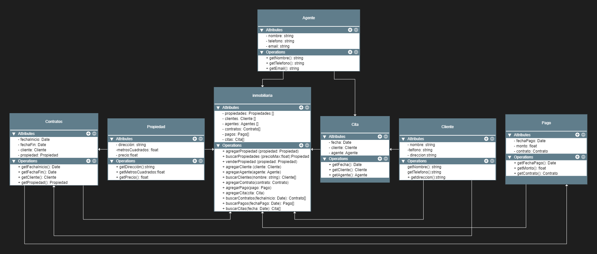

## Inmobiliraria cosecha propia
### Enunciado
Una inmobiliaria necesita un sistema para gestionar su catalogo de propiedades, clientes, agentes, contratos, pagos y citas.
El sistema debe permitir agregar propiedades, clientes, agentes, contratos, pagos y citas. 
Además, debe ser capaz de buscar propiedades por precio máximo, buscar clientes por nombre,
buscar contratos por fecha de inicio, buscar pagos por fechas de pago y buscar citas por fecha.
También se requiere la funcionalidad para vender propiedades y registrar los detalles del contrato, incluyendo fechas, clientes y propiedades involucrados.
El sistema debe ser capaz de manejar múltiples propiedades, clientes, agentes, contratos, pagos y citas.

### Solución

###Relaciones
1. Relación de asociación entre `Inmobiliaria` y `Propiedad`: La inmobiliaria tiene una lista de propiedades. Se representa como una asociación unidireccional desde `Inmobiliaria` hacia `Propiedad`.

2. Relación de asociación entre `Inmobiliaria` y `Cliente`: La inmobiliaria tiene una lista de clientes. Se representa como una asociación unidireccional desde `Inmobiliaria` hacia `Cliente`.

3. Relación de asociación entre `Inmobiliaria` y `Agente`: La inmobiliaria tiene una lista de agentes. Se representa como una asociación unidireccional desde `Inmobiliaria` hacia `Agente`.

4. Relación de asociación entre `Inmobiliaria` y `Contrato`: La inmobiliaria tiene una lista de contratos. Se representa como una asociación unidireccional desde `Inmobiliaria` hacia `Contrato`.

5. Relación de asociación entre `Inmobiliaria` y `Pago`: La inmobiliaria tiene una lista de pagos. Se representa como una asociación unidireccional desde `Inmobiliaria` hacia `Pago`.

6. Relación de asociación entre `Inmobiliaria` y `Cita`: La inmobiliaria tiene una lista de citas. Se representa como una asociación unidireccional desde `Inmobiliaria` hacia `Cita`.

7. Relación de asociación entre `Contrato` y `Cliente`: Un contrato está asociado a un cliente. Se representa como una asociación unidireccional desde `Contrato` hacia `Cliente`.

8. Relación de asociación entre `Contrato` y `Propiedad`: Un contrato está asociado a una propiedad. Se representa como una asociación unidireccional desde `Contrato` hacia `Propiedad`.

9. Relación de asociación entre `Pago` y `Contrato`: Un pago está asociado a un contrato. Se representa como una asociación unidireccional desde `Pago` hacia `Contrato`.

10. Relación de asociación entre `Cita` y `Cliente`: Una cita está asociada a un cliente. Se representa como una asociación unidireccional desde `Cita` hacia `Cliente`.

11. Relación de asociación entre `Cita` y `Agente`: Una cita está asociada a un agente. Se representa como una asociación unidireccional desde `Cita` hacia `Agente`.
